# Heated 3D-Printed Bushing — Closed-Loop Temperature Control

A **3D-printed polycarbonate bushing that heats itself.** Spiral channels printed directly into the part are filled with a **silver-filled conductive adhesive**, turning them into an embedded resistive heater (Joule heating). An **Arduino-based PI controller** regulates the bushing temperature to **60 °C** via PWM.

Developed as a team project in the module *Entwicklung intelligenter Maschinenelemente* (M.Sc. Mechanical Engineering, TH Köln).

<p align="center">
  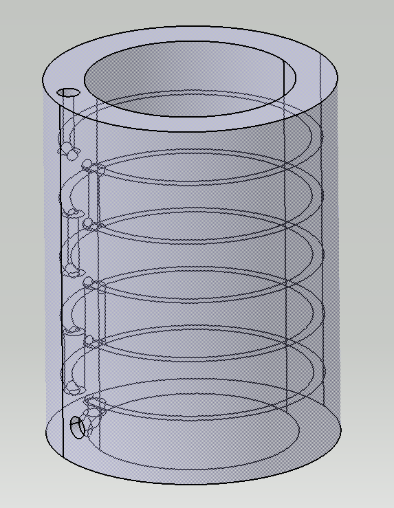
  &nbsp;&nbsp;
  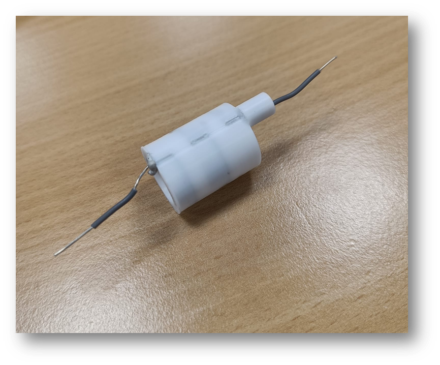
</p>
<p align="center"><em>Final channel design (CAD) and the printed, filled bushing with contact wires</em></p>

## Key Results

| Metric | Baseline (bang-bang) | Final (PI control) |
|---|---|---|
| Heat-up time to 60 °C | 464 s | **55–82 s** |
| Mean deviation from setpoint | — | **0.32 °C** |
| Overshoot | 0.23 °C | 0.52–1.13 °C |
| Long-term stability | — | **> 10 min, no drift** |

PID tuning via Ziegler–Nichols produced 5.9 °C overshoot — switching to a **PI controller with anti-windup** (I-term enabled above 50 °C) cut this to ~1 °C while keeping fast heat-up.

## How It Works

1. **Print** the bushing (FDM, polycarbonate) with integrated spiral channels — no support structures
2. **Inject** silver-filled epoxy adhesive (LOCTITE ABLESTIK 2030SC) into the channels under 3 bar, cure at 95 °C
3. **Heat** by passing current through the cured trace (~1.7 Ω, ~12 W)
4. **Control** with an Arduino: 2× NTC thermistors → PI controller → PWM → logic-level MOSFET

<p align="center">
  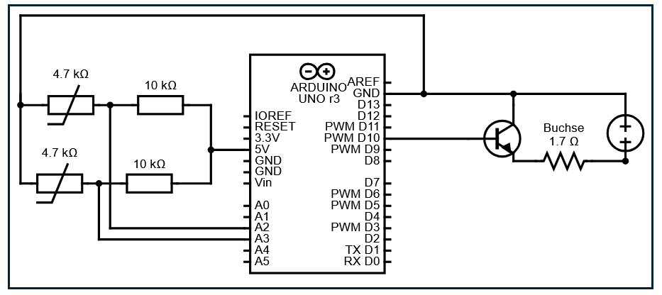
</p>
<p align="center"><em>Control and power stage: Arduino generates the PWM signal, a separate supply drives the heating current</em></p>

## Development

### 1 — What channel sizes can FDM actually print?

Test plates showed that channel orientation is critical: **0.5 mm** diameter is printable parallel to the print bed, but only **1.2 mm** vertically. Printed diameters come out ~6.6 % smaller than CAD.

<p align="center">
  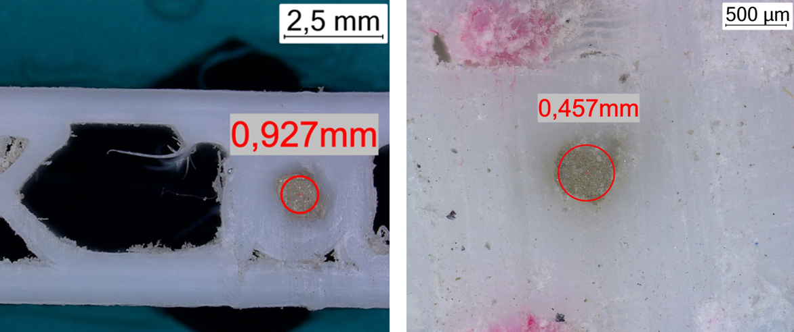
</p>
<p align="center"><em>Minimum printable diameter: Z-orientation (left) vs. XY-orientation (right)</em></p>

### 2 — Which conductive material?

Conductive lacquers, inks, thermal pastes and adhesives were compared on resistivity, viscosity, curing and cost. The silver lacquer failed to fill the channels reliably — the **silver epoxy adhesive** filled them completely and cures into a mechanically stable trace.

<p align="center">
  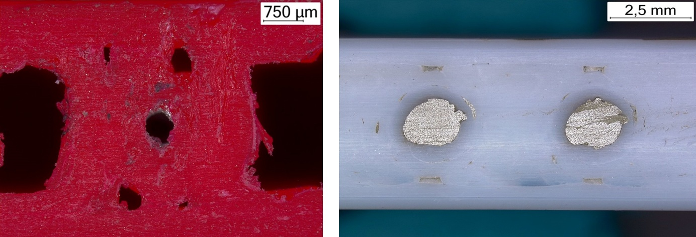
</p>
<p align="center"><em>Silver lacquer in PLA (left) vs. silver adhesive in PC (right)</em></p>

### 3 — Channel geometry: 5 iterations

From U-shaped channels (too little resistance, unprintable at 0.5 mm) to flat spirals oriented parallel to the print bed (printable at 0.75 mm, ~277 mm total channel length).

| | | | |
|:---:|:---:|:---:|:---:|
| 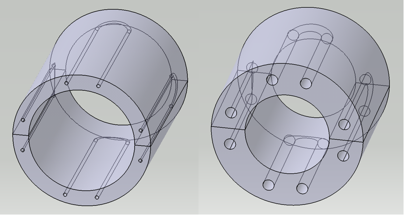 | 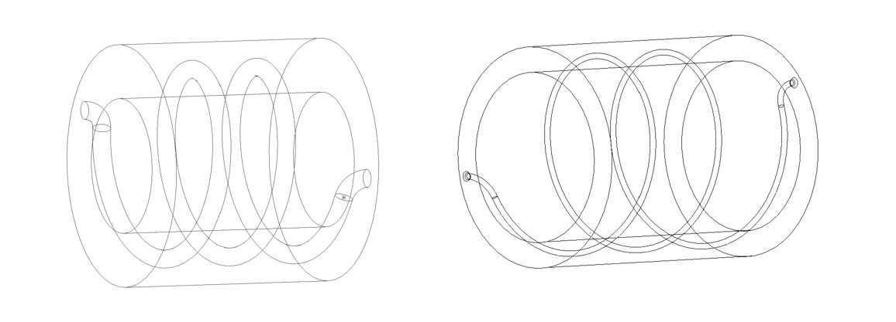 | 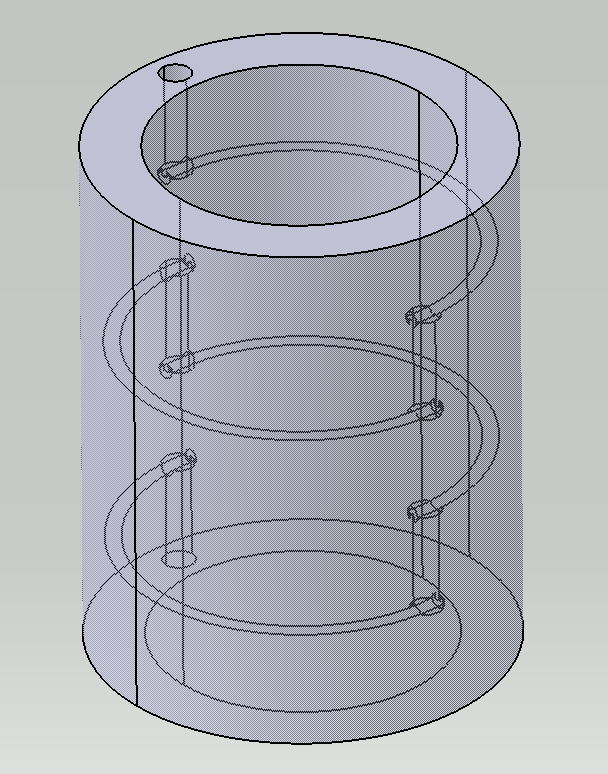 |  |
| **It. 1:** U-channels | **It. 2:** helix | **It. 3:** flat spirals | **It. 5:** final, 5 loops |

### 4 — Filling the channels

The adhesive is injected with a pressure dispenser through a **3D-printed screw-in adapter** (a sacrificial threaded boss is printed onto the bushing and broken off afterwards). Contact wires are inserted before curing. Fill quality is verified non-destructively via resistance measurement — consistent offsets across bushings confirm a **reproducible filling process**.

<p align="center">
  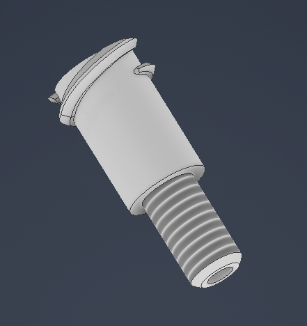
  &nbsp;&nbsp;
  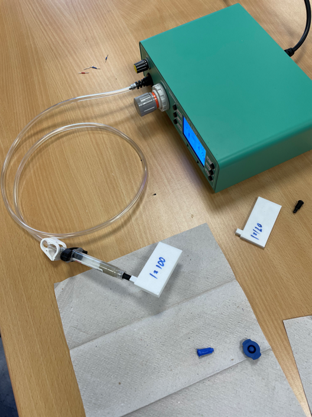
</p>
<p align="center"><em>Screw-in adapter and dispenser setup (3 bar, ~20 s per bushing)</em></p>

## Results

### Control performance

The bang-bang baseline needed almost 8 minutes to reach 60 °C. The final PI-controlled bushing (higher trace resistance → 12 W at safe current) reaches the setpoint in **~1 minute** and holds it at a mean deviation of **0.32 °C**, stable over 10+ minutes.

```
Controller:  Kp = 15,  Ki = 0.5 (enabled above 50 °C, anti-windup),  Kd = 0
Electrical:  5.2 V · 2.3 A ≈ 12 W,  trace resistance 1.7 Ω
```

### Thermal homogeneity

Thermographic analysis (HIKMICRO, ε = 0.9, evaluated in Python) reveals the main limitation: heat concentrates near the channels while the bushing edges drop to ~38 °C.

<p align="center">
  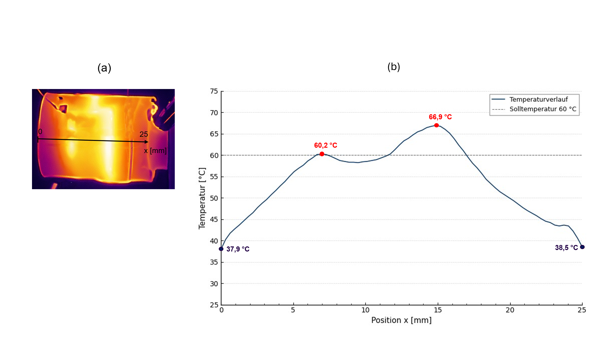
</p>
<p align="center"><em>Thermal image with axial line profile: hot spots above channels, cold zones at the edges</em></p>

<p align="center">
  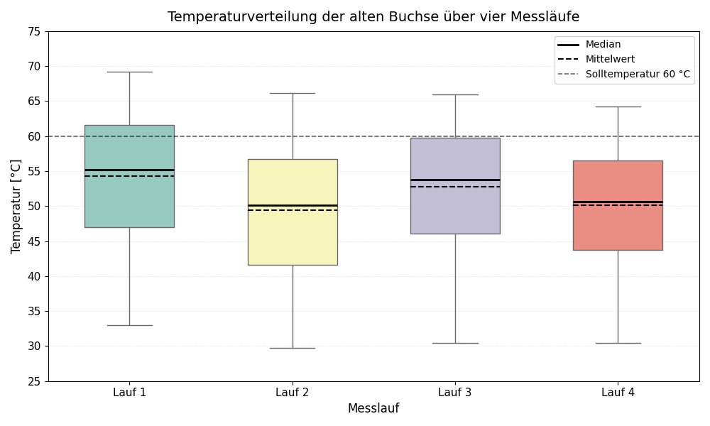
</p>
<p align="center"><em>Pixel temperature distribution over four runs — reproducible, but spatially inhomogeneous</em></p>

## Lessons Learned / Next Steps

- **Sensor placement dominates control dynamics** — surface-mounted NTCs add thermal lag; embedding the sensor in the part would improve tuning
- **Standardize the test rig early** — drafts and repositioning between runs masked real parameter effects until the setup was normalized (enclosure + fixed holder + permanently mounted sensors)
- **Denser channels at the edges** would offset the observed edge heat losses
- A small **GUI for live plotting and parameter tuning** would have sped up every iteration

## Repository Structure

- `firmware/` – Arduino code (PWM, PI controller, logging)
- `cad/` – bushing iterations and channel designs
- `docs/` – documentation and figures
- `measurements/` – raw logs and evaluation scripts
